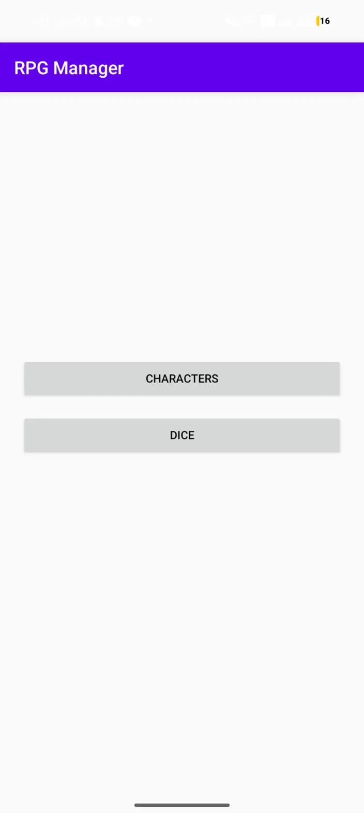
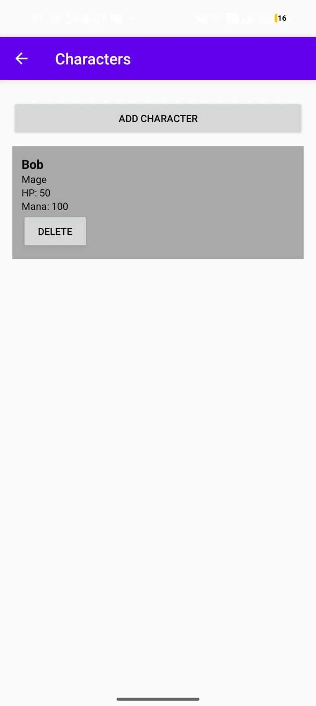
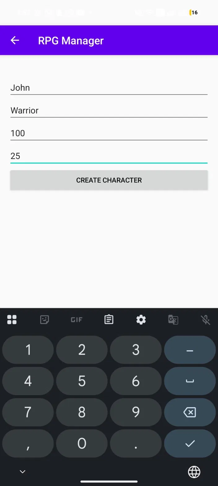
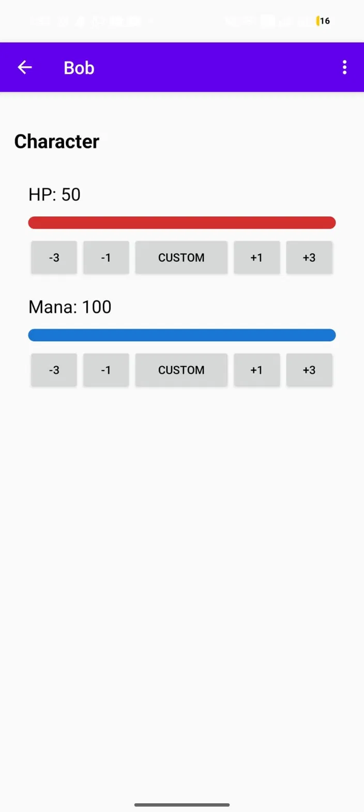
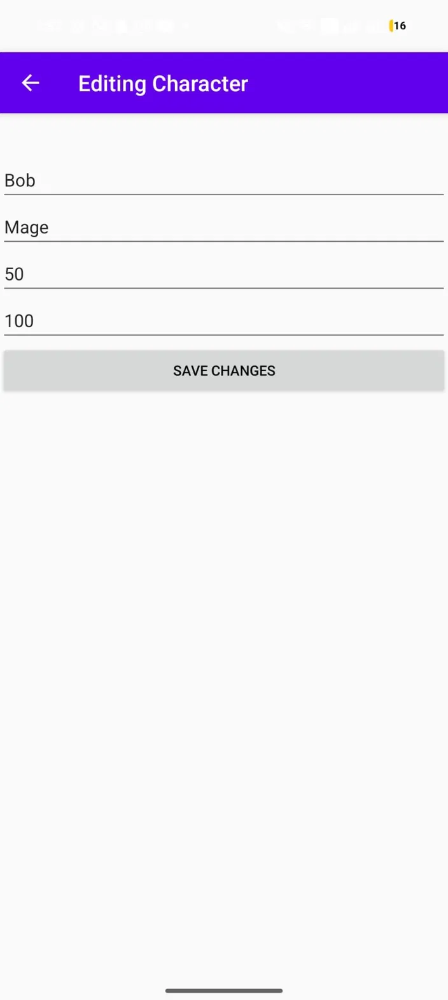
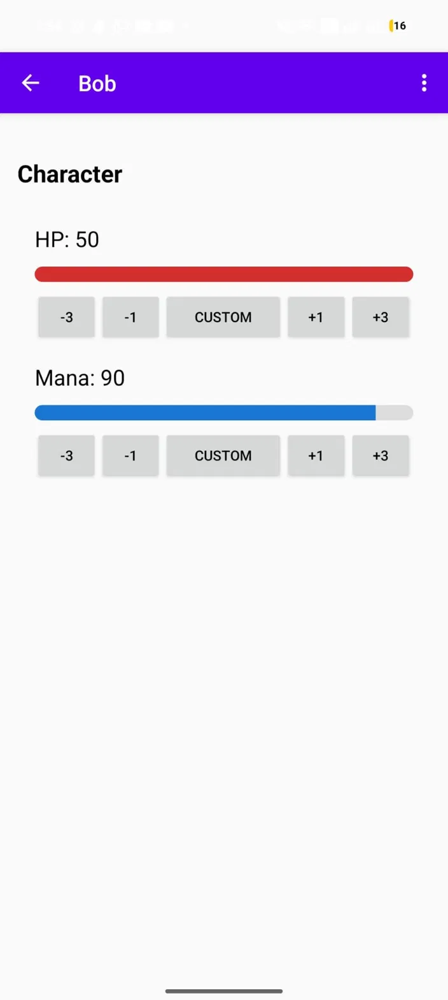
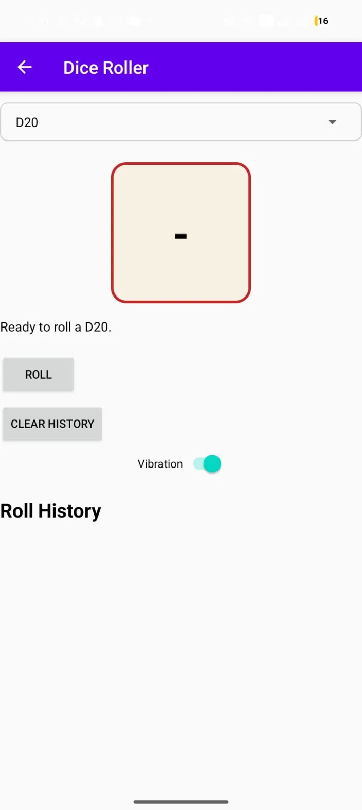

# RPG Party Manager

RPG Party Manager is a native Android app for managing tabletop RPG characters during a game session. It lets players create characters, track HP and Mana, edit character details, share a character sheet, and roll different types of dice with sound and vibration feedback.

## Features

- Create characters with name, class, HP, and Mana
- View all characters in a RecyclerView list
- Preview character HP and Mana from the character list
- Open a character detail screen with HP and Mana bars
- Adjust HP and Mana with `-3`, `-1`, custom amount, `+1`, and `+3` controls
- Reset character stats to the values they had when the detail screen was opened
- Edit character information
- Delete characters from the list
- Share a character sheet through Android's standard share sheet
- Roll D4, D6, D8, D10, D12, D20, D100, or a custom-sided die
- Animated dice rolling with a shaking result panel
- Dice roll history using RecyclerView, limited to the latest 10 rolls
- Clear dice roll history
- Optional roll vibration toggle
- Roll sound support through `app/src/main/res/raw/roll.wav`
- Critical hit and critical failure feedback through a BroadcastReceiver
- Persistent character storage using Room
- Landscape layout support for the character detail screen

## Screenshots

### Main Screen


### Character List


### Create Character


### Character Detail (HP/Mana bars)


### Edit Character


### Custom Stat Change


### Dice Roller


### Dice Roller (with result & history)


---

## Who Did What

- **Maxim**: Dice roller, stat controls, README
- **Nhat**: README setup, project structure
- **Adithya**: Room database, character creation/editing
- **Chris**: UI design, character list
- **Jamie**: Testing, bug fixes

---

## Tech Stack

- Java
- Android Studio
- AndroidX AppCompat
- RecyclerView
- Fragments
- Room persistence library
- BroadcastReceiver
- Android vibration hardware API
- Android implicit Intents for sharing

## Project Structure

```text
app/src/main/java/com/example/rpgpartymanager/
  activities/
    MainActivity.java
    CharacterListActivity.java
    CharacterDetailActivity.java
    CreateCharacterActivity.java
    EditCharacterActivity.java
    DiceRollActivity.java
    SettingsActivity.java

  adapters/
    CharacterAdapter.java
    RollHistoryAdapter.java

  data/
    AppDatabase.java
    CharacterDao.java
    CharacterEntity.java

  fragments/
    StatsFragment.java
    InventoryFragment.java

  models/
    Character.java
    CharacterEntity.java

  receivers/
    DiceReceiver.java

  utils/
    DiceManager.java
```

```text
app/src/main/java/com/example/rpgpartymanager/
  activities/
    MainActivity.java
    CharacterListActivity.java
    CharacterDetailActivity.java
    CreateCharacterActivity.java
    EditCharacterActivity.java
    DiceRollActivity.java
    SettingsActivity.java

  adapters/
    CharacterAdapter.java
    RollHistoryAdapter.java

  data/
    AppDatabase.java
    CharacterDao.java
    CharacterEntity.java

  fragments/
    StatsFragment.java
    InventoryFragment.java

  models/
    Character.java
    CharacterEntity.java

  receivers/
    DiceReceiver.java

  utils/
    DiceManager.java
```

## Database Schema

The app uses a Room database with one main entity:

`CharacterEntity`

- `id`: auto-generated primary key
- `name`: character name
- `role`: character class or role
- `hp`: current HP
- `mana`: current Mana

## How to Run

1. Open the project root folder in Android Studio.
2. Wait for Gradle sync to finish.
3. Select an emulator or physical Android device.
4. Press Run.

Minimum SDK: API 24.

## Application Flow

1. The main screen provides navigation to the character list and dice roller.
2. The character list loads saved characters from Room.
3. Selecting a character opens the detail screen.
4. The detail screen displays HP and Mana through `StatsFragment`.
5. The fragment sends stat changes back to `CharacterDetailActivity`.
6. Updated stats are saved immediately in Room.
7. The character menu can share the current sheet or reset stats.
8. The dice roller supports preset/custom dice, animation, sound, vibration, and history.

## External Libraries

- AndroidX AppCompat: Activity compatibility and action bar support.
- AndroidX RecyclerView: character list and dice roll history.
- AndroidX Fragment: stat display and Activity/Fragment interaction.
- Room: local persistent character database.
- Material components: UI component support from the generated Android project.

## Defense Checklist Mapping

- Multiple Activities and Intents: main, character list, character detail, edit/create character, dice roller, plus share Intent.
- Orientation handling: character detail has a landscape layout.
- Fragment: `StatsFragment` displays stats and communicates stat changes to the Activity.
- Menu: character detail menu supports share, reset, and edit actions.
- Advanced view component: RecyclerView is used for characters and roll history.
- Themes and styles: app theme and reusable text/button styles are defined in resources.
- Phone hardware feature: dice rolling can use vibration feedback.
- System-level component: `DiceReceiver` handles dice roll broadcast events.

## Future Improvements

- Expand inventory management.
- Add equipment and item effects.
- Add character portraits.
- Add accessibility labels and larger text polish.
- Add instrumented tests for character creation, stat changes, and dice rolls.
